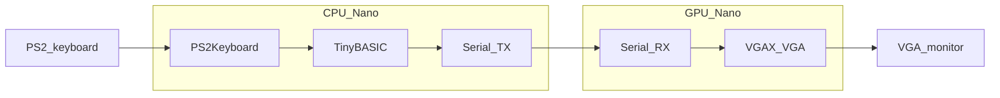

# Physical and code setup (from repo)

This document maps hardware wiring and firmware roles for the Arduino Tiny BASIC “computer,” as implemented in this repository.

## Physical setup

**Two boards (both described as Arduino Nano in the master sketch header):**

### 1. CPU (“master”)

Sketch: [Arduino_Tiny_Basic_1/PS2_Keyboard_Master_v0_30_commented/PS2_Keyboard_Master_v0_30_commented.ino](../Arduino_Tiny_Basic_1/PS2_Keyboard_Master_v0_30_commented/PS2_Keyboard_Master_v0_30_commented.ino)

- **PS/2 keyboard:** `DataPin = 8` (data), `IRQpin = 3` (clock). Clock must be a pin that supports external interrupt (2 or 3 on ATmega328).
- **Serial to GPU:** CPU **TX → GPU RX** at **4800 baud** (`kConsoleBaud`). Comments in the sketch warn that 9600 can disturb PS/2 shift state.
- **Optional piezo** (only if `ENABLE_TONES` is enabled): `kPiezoPin` defaults to **5** (one leg to pin, other to GND). Currently **disabled** in the sketch (`#undef ENABLE_TONES`).
- **EEPROM:** On-chip AVR EEPROM when `ENABLE_EEPROM` is on (**enabled**). Used for `ELOAD` / `ESAVE` / related commands.
- **I/O from BASIC:** `AREAD(pin)` → `analogRead`; `DREAD(pin)` → `digitalRead` (both force `pinMode(..., INPUT)`). `AWRITE` / `DWRITE` → `analogWrite` / `digitalWrite` with `pinMode(..., OUTPUT)` (see `awrite` / `dwrite` in the master sketch).

### 2. GPU (“slave”)

Sketch: [Arduino_Tiny_Basic_1/VGA_Graphics_Slave_v1_5/VGA_Graphics_Slave_v1_5.ino](../Arduino_Tiny_Basic_1/VGA_Graphics_Slave_v1_5/VGA_Graphics_Slave_v1_5.ino)

- Uses **[VGAX](https://github.com/smaffer/vgax)** ([VGAX.h](../Arduino_Tiny_Basic_1/VGA_Graphics_Slave_v1_5/VGAX.h)): **120×60** framebuffer, **4 colors**, VGA output via the **standard VGAX resistor-ladder wiring** for Uno/Nano-class AVR (full wiring is in the upstream library documentation).
- `Serial.begin(4800)` — must match the CPU.

### Host PC (optional)

The [Tiny Basic Sender](../Tools/Tiny%20Basic%20Sender/README.md) tool uploads `.bas` files over **USB serial** to the **CPU** Nano at **4800 baud**; the boot password is still entered on the **device keyboard**.

---

## Code / firmware setup

| Role | Sketch | Libraries | Main job |
| ---- | ------ | ----------- | -------- |
| CPU | `PS2_Keyboard_Master_v0_30_commented.ino` | `PS2Keyboard`, `EEPROM`, AVR `pgmspace` | Interpreter, keyboard input, boot UI, sends **CR-only** text and control bytes to GPU |
| GPU | `VGA_Graphics_Slave_v1_5.ino` | `VGAX` | Receives bytes on Serial, renders terminal (wrap, colors, backspace, Ctrl+L clear, etc.) |

**CPU memory model** (documented at top of the master sketch): single `program[kRamSize]` buffer (**1024** bytes); holds sorted BASIC lines, variables A–Z (`short`), and FOR/GOSUB stacks.

**Display protocol (CPU → GPU):** Documented in the master file header: **CR (13)** newline; **LF** avoided after CR (GPU ignores LF; extra LF can waste space or cause odd wrapping); backtick `` ` `` (ASCII 96) advances print color in a cycle; **`~`** draws a solid block in the current color; **backspace** erases; **Ctrl+L (12)** clears the screen (cursor/color behavior per GPU sketch); **SI (14)** resets print color to default green.

**Interpreter surface:** See [TINYBASIC_SYNTAX.md](TINYBASIC_SYNTAX.md) (checked against the master sketch). **PEEK** / **POKE** are not implemented in this build.

**Build flags (master):** **`ENABLE_TONES`** and **`ENABLE_EEPROM`** are always **on** (fixed `#define`s). **`ENABLE_EAUTORUN`** remains **off** unless you add `#define ENABLE_EAUTORUN` in the sketch. SD card / file-style **`LOAD`/`SAVE`** hooks are not present in this build (Serial + EEPROM only).

---

## Supporting files

- [int_pins.h](../Arduino_Tiny_Basic_1/PS2_Keyboard_Master_v0_30_commented/int_pins.h) — PS2 library interrupt pin mapping for various boards (Nano/Uno path uses INT0/INT1 on pins 2/3).
- Python sender and syntax checker under `Tools/Tiny Basic Sender/`, aligned with this manual and the master sketch rules.
