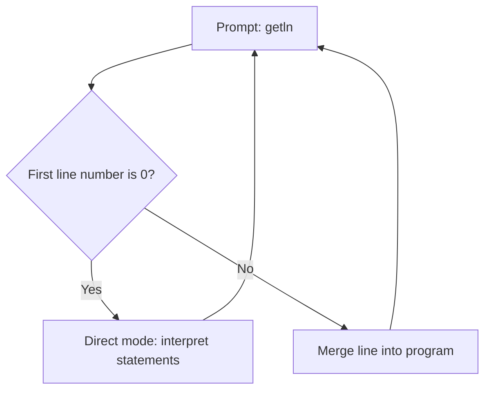

# Tiny BASIC — system reference

Source sketches: CPU / interpreter — [`PS2_Keyboard_Master_v0_30_commented.ino`](../Arduino_Tiny_Basic_1/PS2_Keyboard_Master_v0_30_commented/PS2_Keyboard_Master_v0_30_commented.ino); GPU / VGA — [`VGA_Graphics_Slave_v1_5.ino`](../Arduino_Tiny_Basic_1/VGA_Graphics_Slave_v1_5/VGA_Graphics_Slave_v1_5.ino). This document matches the interpreter and display behavior implemented there.

Each command table includes an **Example** column (at the `>` prompt or in a numbered line, as noted).

---

## 1. Scope

| Layer | Role | Example |
| ----- | ---- | ------- |
| **CPU** | Tiny BASIC interpreter, PS/2 keyboard, serial to GPU, EEPROM and piezo (always on in this build). | You type `PRINT 1` at `>` |
| **GPU** | Receives bytes on serial, draws text and cursor on VGA (VGAX). | Shows output from **`PRINT`** |
| **Boot UI** | Border frame, password gate, storage bars | Password `Tron` on keyboard |

---

## 2. Program format and line entry

- **Stored line layout:** `[LINENUM: 2 bytes][LEN: 1 byte][rest of line text ending with NL]`. Lines are kept sorted by line number.
- **Entering a line:** If the first number parsed from the buffer is **0**, the line is **direct mode** (execute immediately, not stored). If it is non-zero, the text is merged into the program (insert or replace an existing line with the same number).
- **Deleting a line:** Enter a line that is only a line number and end-of-line (no statement text) to remove that numbered line.
- **Multiple statements:** Use **`:`** between statements on one program line.
- **Case:** After input, characters outside quoted strings are uppercased (`A`–`Z`), so keywords are effectively case-insensitive.

| Topic | Example |
| ----- | ------- |
| Direct mode (no line number) | `PRINT 1+2` |
| Stored line | `10 A = 3` |
| Two statements on one line | `20 A = 1 : PRINT A` |
| Delete line 10 | `10` then Enter (line number only) |
| Replace or correct a line | Enter line number needing correction `30` with the replacement code `PRINT "Hello"`

---

## 3. Expressions

- **Type:** Signed 16-bit integers only (no floating point).
- **Variables:** Single letters **`A`** through **`Z`** only.
- **Literals:** Decimal integers; leading **`0`** is a lone zero (not octal).
- **Operators:** `+` `-` `*` `/` (integer division). Unary `-` on expressions. Parentheses **`(...)`**.
- **Relational operators (return 0 or 1):** `>=` `<>` `>` `=` `<=` `<` `!=`  
  A relational expression is: *arithmetic* *relop* *arithmetic*.

| Operator use | Example |
| ------------ | ------- |
| Equality test | `PRINT 1 = 1` → prints `1` |
| Compare variables | `10 IF A >= B THEN PRINT "OK"` |

**Built-in functions**

| Function | Meaning | Example |
| -------- | ------- | ------- |
| `ABS(x)` | Absolute value. | `PRINT ABS(3-9)` |
| `RND(n)` | Random in `0 .. n-1` (Arduino: `random(n)`). | `PRINT RND(6)` |

**Pin I/O** (reads and writes on GPIO) is documented in one place: [§4.5 Pin I/O (Arduino)](#45-pin-io-arduino).

---

## 4. Statements (BASIC commands)

Legend: *stmt* = one statement; *expr* = expression; line targets for `GOTO`/`GOSUB` are expressions (so `GOTO 100` or `GOTO L` work if `L` holds the line number). The **Example** column shows minimal valid usage unless noted (direct at `>` or numbered line).

### 4.1 Program and session

| Command | Form / use | Example |
| ------- | ---------- | ------- |
| **RUN** | Start execution at the lowest line number. | `RUN` |
| **NEW** | Clear program; nothing may follow **`NEW`** on the same line (except end of line). | `NEW` |
| **LIST** | `LIST` whole program. `LIST 100` that line only (must exist). `LIST ,100` first line through 100. `LIST 100,` line 100 through end. `LIST 100,200` inclusive range (`100` ≤ `200`, start line must exist). `LIST ,` alone is an error. | `LIST` / `LIST 50` / `LIST ,120` / `LIST 100,` / `LIST 10,99` |
| **BYE** | `return` from Arduino `loop()`; the sketch runs **`loop()` again**, so the **full boot sequence** (including password) runs again — not a silent exit. | `BYE` |
| **END** | Stop the program. Trailing characters on the same line are not allowed after **`END`**. | `10 END` |

### 4.2 Flow control

| Command | Form / use | Example |
| ------- | ---------- | ------- |
| **GOTO** *expr* | Jump to line *expr* if that line exists. | `GOTO 100` / `10 GOTO L` |
| **GOSUB** *expr* | Push return point, run line *expr*. | `10 GOSUB 200` |
| **RETURN** | Pop one **GOSUB** frame; error if none. | `210 RETURN` |
| **IF** *expr* | Evaluate *expr* (may include relations). There must be **more text on the same line** after the condition (not end-of-line immediately — that is an error). If **non-zero**, continue with the rest of the line (often **`THEN`** *stmt*). If **zero**, skip the **entire remainder of this program line** — including any further statements after **`:`**. | `10 IF A=1 THEN PRINT "OK"` |
| **THEN** | Optional keyword after **`IF`**; may also appear as redundant statement keyword. | `20 IF B>0 THEN PRINT B` |

### 4.3 Assignment and I/O

| Command | Form / use | Example |
| ------- | ---------- | ------- |
| **LET** | `LET A = expr` or bare **`A = expr`**. | `LET X = 5` / `X = 5` |
| **INPUT** / **`?`** | `INPUT A` or **`? A`** (single variable **A**–**Z**). Types a **`?`** prompt, reads a line, parses one expression. | `10 INPUT N` / `10 ? N` |
| **PRINT** / **`.`** | See [§5 PRINT](#5-print-and-). | `PRINT "HI", A` / `. 42` / `."OK"` |
| **REM** | Comment to end of line. | `10 REM SETUP` |
| **DATA** | Declares comma-separated integer literals for **READ** (line is not executed). | `100 DATA 1, 2, -3` |
| **READ** *var* [`,` *var* …] | Assigns the next values from **DATA** lines (in line-number order) to variables **A**–**Z**. | `10 READ A, B` |
| **RESTORE** | Reset **READ** to the first **DATA** item. **`RESTORE`** *expr* resets to the first **DATA** on or after line *expr*. | `RESTORE` / `RESTORE 500` |

### 4.4 Loops

| Command | Form / use | Example |
| ------- | ---------- | ------- |
| **FOR** | `FOR V = expr TO expr` or `FOR V = expr TO expr STEP expr` (**V** = `A`–`Z`). | `10 FOR I = 1 TO 5` / `10 FOR J = 10 TO 0 STEP -2` |
| **NEXT** | `NEXT V` — **V** must match the inner **FOR** variable being closed. | `40 NEXT I` |

Stack holds **FOR** and **GOSUB** frames (limited depth; see **STACK OVERFLOW** in §8).

### 4.5 Pin I/O (Arduino)

Everything that drives or reads an Arduino GPIO pin is grouped here (same semantics as the `awrite` / `dwrite` / `AREAD` / `DREAD` paths in the master sketch).

**Read (expressions)**

| Function | Behavior | Example |
| -------- | -------- | ------- |
| **`AREAD(pin)`** | `pinMode(pin, INPUT)` then `analogRead(pin)` (0–1023 on typical AVR). | `PRINT AREAD(0)` |
| **`DREAD(pin)`** | `pinMode(pin, INPUT)` then `digitalRead(pin)` (0 or 1). | `A = DREAD(4)` |

**Write (statements)**

| Command | Behavior | Example |
| ------- | -------- | ------- |
| **`AWRITE`** *pin*, *value* | `pinMode(pin, OUTPUT)` then `analogWrite(pin, value)`. Second argument: keyword **`HIGH`** / **`HI`** / **`LOW`** / **`LO`** (1 or 0), **or** any numeric *expr* (e.g. PWM 0–255 where supported). | `AWRITE 9, 128` |
| **`DWRITE`** *pin*, *value* | Same pattern using `digitalWrite`. | `DWRITE 13, HIGH` |

**Summary:** *pin* and *value* are expressions; keywords **`HIGH`**, **`HI`**, **`LOW`**, **`LO`** select 1 or 0 without a separate expression.

**Related:** **TONE** / **TONEW** / **NOTONE** drive the fixed piezo output **`kPiezoPin`** (default 5) — see [§4.7 Sound](#47-sound).

### 4.6 Screen, timing, and memory (Arduino)

| Command | Form / use | Example |
| ------- | ---------- | ------- |
| **CLS** | Sends form-feed (12); clears GPU screen per protocol. Must be followed immediately by **newline** or **`:`** (another statement on the same physical line). | `CLS` / `10 CLS: PRINT "OK"` |
| **MEM** | Clears screen, then prints SRAM / EEPROM / BASIC free summaries and bar graphs (serial). | `MEM` |
| **DELAY** *expr* | `delay(expr)` milliseconds. | `DELAY 500` / `10 DELAY 1000` |
| **RSEED** *expr* | `randomSeed(expr)` (or `srand` on non-Arduino). | `RSEED 42` |

### 4.7 Sound

| Command | Form / use | Example |
| ------- | ---------- | ------- |
| **TONE** *freq*, *dur* | `tone(pin, freq, dur)`. If *freq* or *dur* is 0, behaves like **NOTONE**. | `TONE 440, 200` |
| **TONEW** *freq*, *dur* | Same as **TONE** but also **`delay(dur)`** after starting the tone (wait variant). | `TONEW 523, 300` |
| **`!`** *freq*, *dur* | **Alias for TONEW** (saves bytes in programs). Same rules as **TONEW**. Not an expression operator; safe inside quoted strings (e.g. `PRINT "Hi!"`). | `! 523, 300` |
| **NOTONE** | Stops tone on the piezo pin. | `NOTONE` |

### 4.8 EEPROM

| Command | Use | Example |
| ------- | --- | ------- |
| **ELIST** | Dump EEPROM to screen until a zero byte. | `ELIST` |
| **EFORMAT** | Clear EEPROM (zeros). | `EFORMAT` |
| **ESAVE** | Write current program to EEPROM as text, terminated with `'\0'`. | `ESAVE` *(at `>` prompt)* |
| **ELOAD** | Load program from EEPROM into memory (paced read). | `ELOAD` *(at `>` prompt)* |
| **ECHAIN** | Load from EEPROM then **RUN** after load completes. | `ECHAIN` *(at `>` prompt)* |

Leave free BASIC program buffer space before **`ELOAD`**, **`ECHAIN`**, **`ESAVE`**, or **`EFORMAT`** alongside a large in-memory program (the same buffer holds stored lines and merge scratch). Use **`MEM`** to check the BASIC bar, or **`NEW`** / delete lines if you are close to the limit; otherwise merges and EEPROM flows can hit **OUT OF MEMORY**.

Boot option **`ENABLE_EAUTORUN`** (off in the stock sketch): if defined and `EEPROM[0]` is `'0'`–`'9'`, load from EEPROM on power-up and run.

---

## 5. PRINT and `.`

| Rule | Meaning | Example |
| ---- | ------- | ------- |
| **Items** | Quoted string (`"` or `'`, including UTF-8 “smart quotes”) **or** expression (printed as decimal). | `PRINT "HI", 42` |
| **Comma `,`** | Separates items; **no** extra space or tab between outputs. | `PRINT "A", "B", "C"` → `ABC` |
| **`.`** | Same as **PRINT** (one ASCII period; not part of numbers — this BASIC uses integers only). | `. X+1` / `."OK"` |
| **Semicolon `;`** | Only **at the end** of **PRINT** / **`.`**: **`;`** then newline or **`:`** suppresses final carriage return. **`;`** between two items → syntax error. | `PRINT "X";` then next line `PRINT "Y"` (same row until CR) |
| **Empty PRINT** | Blank line output (with newline unless `;` rule applies). | `PRINT` / `.` |

---

## 6. Console → GPU protocol (CPU sends, GPU interprets)

Aligned with the master sketch header and `process_input_byte` on the slave.

| Byte | Name / effect | Example / source |
| ---- | ------------- | ------------------ |
| **13 (CR)** | If `x != 0`: move to the next text row (`x = 0`, `y += 6`, scroll if needed). If `x == 0`, no-op. The GPU does **not** print **`>`**; the CPU sends the prompt. | After each **PRINT** line; `line_terminator()` |
| **10 (LF)** | Ignored (use **CR** for newline; avoids a second step when hosts send **CRLF**). | Prefer CR-only from tools |
| **96 `` ` ``** | Advance print color (green → yellow → red → green). Double backtick moves one step **back** in the cycle. | Typed at `>` prompt (not stored in line buffer) |
| **126 `~`** | Draws block graphic in current color. | `PRINT "~"` in a string, or boot border text |
| **8 / 127** | Backspace: erase one cell, move cursor back. | While editing a line at `>` or during **INPUT** |
| **12 (Ctrl+L)** | Clear framebuffer; cursor position and color are **not** fully reset (see slave). | **CLS** → `outchar(12)` |
| **14 (SI)** | **`GPU_COLOR_RESET`** — set default print color to green. | **MEM** / prompt path sends `GPU_COLOR_RESET` |
| **27 (ESC)** | On GPU: clear screen, home cursor. | **ESC** read as input on GPU serial (not the same as CPU **BREAK**) |

**Line width:** **120** px, **5** px per character (**24** columns; last start **x = 115**). When `x >= 120`, the slave wraps to the next row (before drawing the next glyph so nothing is clipped at the right edge).

---

## 7. Interactive input (keyboard and prompt)

These are **not** BASIC statements; they apply at the **`>`** prompt and during **`INPUT`**.

| Action | Behavior | Example |
| ------ | -------- | ------- |
| **Enter (CR)** | Finish line; non-empty lines are stored in a **3-line** history. | Type `RUN` then Enter |
| **Up arrow** | Recall older lines from history (newest first step). | After typing at `>`, Up restores last line |
| **Down arrow** | Move toward newer history, or clear to blank when at newest. | While browsing history, Down moves forward |
| **Backspace / Delete** | Edit buffer; echoed as backspace on display. | Fix typo before Enter |
| **`` ` ``** | Sent to GPU for color only; **not** stored in the line buffer (history will not replay it). | Press `` ` `` before typing (color only) |
| **ESC during RUN** | Break: prints **`BREAK IN`** *line* and stops (see `breakcheck`). | Press ESC while program runs |

Buffer grows toward variables region; at limit the terminal bell is sent.

---

## 8. Error messages

Strings match [`PS2_Keyboard_Master_v0_30_commented.ino`](../Arduino_Tiny_Basic_1/PS2_Keyboard_Master_v0_30_commented/PS2_Keyboard_Master_v0_30_commented.ino) (`PROGMEM` message table). Most errors print **` IN `** *line number* when the fault happens during **RUN** (not in direct mode at `>`). **SYNTAX ERROR**, **CMD ERROR**, **EXPRESSION ERROR**, **LINE NUMBER ERROR**, **COLOR TICK ERROR**, and **LOOP ERROR** use the caret/pointer line when applicable; **DIVIDE BY 0 ERROR**, **STACK OVERFLOW**, **OUT OF MEMORY**, and **GOSUB ERROR** use the shorter red path (no pointer).

| Message | Typical cause | Example |
| ------- | ------------- | ------- |
| **SYNTAX ERROR** | Bad statement shape, bad **PRINT** separators, extra tokens, etc. (no expression fault code set). | `PRINT A;B` *(bad `;` between items)* |
| **CMD ERROR** | Unknown command (not a keyword and not `A`–`Z` `=` assignment). | `FOO 1` |
| **EXPRESSION ERROR** | Bad or incomplete numeric expression, or wrong operand where the parser expected one (including some “wrong variable / missing `=`” cases that still route here). | `IF` with nothing after condition on the line; `LET A = 1 +` |
| **LINE NUMBER ERROR** | **GOTO**/**GOSUB**/**LIST** target missing or invalid line number. | `GOTO 9999` *(no such line)* |
| **OUT OF DATA** | **READ** requested another value but no **DATA** item remains. | `READ X` with no matching data |
| **COLOR TICK ERROR** | Stray or invalid `` ` `` (color tick) where the command parser rejects it. | Direct line: spaces then `` ` `` before a statement |
| **DIVIDE BY 0 ERROR** | Division by zero in an expression. | `PRINT 1/0` |
| **STACK OVERFLOW** | Too many nested **FOR** / **GOSUB**. | Deep nested **GOSUB** without **RETURN** |
| **OUT OF MEMORY** | Program too large for buffer. | Many long lines |
| **GOSUB ERROR** | **RETURN** without matching **GOSUB**. | `RETURN` in direct mode |
| **LOOP ERROR** | **NEXT** with no matching **FOR** on the stack. | `NEXT I` when no **FOR** *I* is active |
| **BREAK** | **ESC** pressed while program is running. | Prints **`BREAK IN `** *line* |

---

## 9. Build flags (this repository)

Values are taken from [`PS2_Keyboard_Master_v0_30_commented.ino`](../Arduino_Tiny_Basic_1/PS2_Keyboard_Master_v0_30_commented/PS2_Keyboard_Master_v0_30_commented.ino):

| Symbol | Current setting | Example effect |
| ------ | ----------------- | ---------------- |
| **`kConsoleBaud`** | `4800` — must match GPU `Serial.begin(...)`. | Host serial tool uses **4800** to match CPU |
| **`ENABLE_TONES`** | **Always on** in this build (`#define`); not user-togglable. **TONE**, **TONEW**, **`!`**, **NOTONE** and boot chime; **`kPiezoPin`** default **5**. | `TONE 440, 100` uses pin **5** |
| **`ENABLE_EEPROM`** | **Always on** in this build; EEPROM commands always available. | `ESAVE` at `>` writes program to EEPROM |
| **`ENABLE_EAUTORUN`** | **Off** (`#undef`) — optional: define in the sketch to auto-load/run from EEPROM at boot. | *(not active in stock build)* |
| **`kErrorLedPin`** | `6` — on when the interpreter reports an error; turned off after a **successful direct-mode line**, **`CLS`**, **`RUN`**, **`LIST`** (before **`OK`**), **`BYE`**, EEPROM load/save paths that return to **`OK`**, and autorun start. | LED on after **`SYNTAX ERROR`** |

Program RAM size: **`kRamSize`** = **1024** bytes (fixed in the master sketch; must match **`BASIC_PROGRAM_LIMIT_BYTES`** in Tiny Basic Sender — see [`tiny_basic_syntax.py`](../Tools/Tiny%20Basic%20Sender/tiny_basic_syntax.py)).

---

## 10. Execution flow (overview)

Typing **`RUN`** at the prompt (as a direct command) starts execution from the first program line; **`END`** or running out of lines ends the run and returns to the prompt with **`OK`**.

During **RUN**, when **`IF`** is false, control goes to the **next physical program line**, not to the next **`:`**-separated statement on the same line.

---

## 11. Quick keyword list (interpreter)

`LIST` `NEW` `RUN` `NEXT` `LET` `IF` `THEN` `GOTO` `GOSUB` `RETURN` `REM` `FOR` `INPUT` `?` `PRINT` `.` `BYE` `CLS` `MEM` `AWRITE` `DWRITE` `DELAY` `END` `RSEED` `TONEW` `!` `TONE` `NOTONE` `ECHAIN` `ELIST` `ELOAD` `EFORMAT` `ESAVE`

**Functions:** `ABS` `RND` — plus pin reads **`AREAD`** **`DREAD`** ([§4.5](#45-pin-io-arduino))  
**FOR helpers:** `TO` `STEP`  
**Pin writes:** **`AWRITE`** **`DWRITE`** ([§4.5](#45-pin-io-arduino)) — values: `HIGH` `HI` `LOW` `LO` or any numeric expression.
