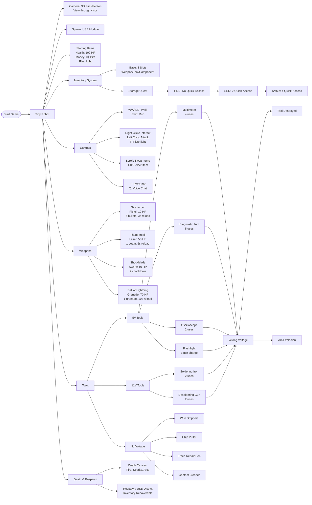

# Character Overview Chart

```mermaid
flowchart LR

  Start([Start Game]) --> Character["Tiny Robot"]
  
  Character --> Camera[Camera: 3D First-Person<br/>View through visor]
  Character --> Spawn[Spawn: USB Module]
  
  Character --> Stats["Starting Items<br/>Health: 100 HP<br/>Money: 0฿ Bits<br/>Flashlight"]
  
  Character --> Inventory[Inventory System]
  Inventory --> BaseSlots[Base: 3 Slots<br/>Weapon/Tool/Component]
  
  Inventory --> StorageUpgrade[Storage Quest]
  StorageUpgrade --> HDD[HDD: No Quick-Access]
  HDD --> SSD[SSD: 2 Quick-Access]
  SSD --> NVMe[NVMe: 4 Quick-Access]
  
  Character --> Controls[Controls]
  Controls --> Movement[W/A/S/D: Walk<br/>Shift: Run]
  Controls --> Actions[Right Click: Interact<br/>Left Click: Attack<br/>F: Flashlight]
  Controls --> InventoryCtrl[Scroll: Swap Items<br/>1-0: Select Item]
  Controls --> Conditional[T: Text Chat<br/>Q: Voice Chat]
  
  Character --> Weapons[Weapons]
  Weapons --> Skypiercer[Skypiercer<br/>Pistol: 10 HP<br/>5 bullets, 3s reload]
  Weapons --> Thundercoil[Thundercoil<br/>Laser: 50 HP<br/>1 beam, 6s reload]
  Weapons --> Shockblade[Shockblade<br/>Sword: 10 HP<br/>2s cooldown]
  Weapons --> BallLightning[Ball of Lightning<br/>Grenade: 70 HP<br/>1 grenade, 10s reload]
  
  Character --> Tools[Tools]
  Tools --> Voltage5V[5V Tools]
  Tools --> Voltage12V[12V Tools]
  Tools --> NoVoltage[No Voltage]
  
  Voltage5V --> Multimeter[Multimeter<br/>4 uses]
  Voltage5V --> Diagnostic[Diagnostic Tool<br/>5 uses]
  Voltage5V --> Oscilloscope[Oscilloscope<br/>2 uses]
  Voltage5V --> Flashlight[Flashlight<br/>3 min charge]
  
  Voltage12V --> Soldering[Soldering Iron<br/>2 uses]
  Voltage12V --> Desoldering[Desoldering Gun<br/>2 uses]
  
  Multimeter --> WrongVoltage[Wrong Voltage]
  Diagnostic --> WrongVoltage
  Oscilloscope --> WrongVoltage
  Flashlight --> WrongVoltage
  Soldering --> WrongVoltage
  Desoldering --> WrongVoltage
  WrongVoltage --> ToolDestroy[Tool Destroyed]
  WrongVoltage --> Explosion[Arc/Explosion]
  
  NoVoltage --> WireStrippers[Wire Strippers]
  NoVoltage --> ChipPuller[Chip Puller]
  NoVoltage --> TracePen[Trace Repair Pen]
  NoVoltage --> ContactCleaner[Contact Cleaner]
  
  Character --> Death[Death & Respawn]
  Death --> Hazards[Death Causes:<br/>Fire, Sparks, Arcs]
  Death --> Respawn[Respawn: USB District<br/>Inventory Recoverable]
```

