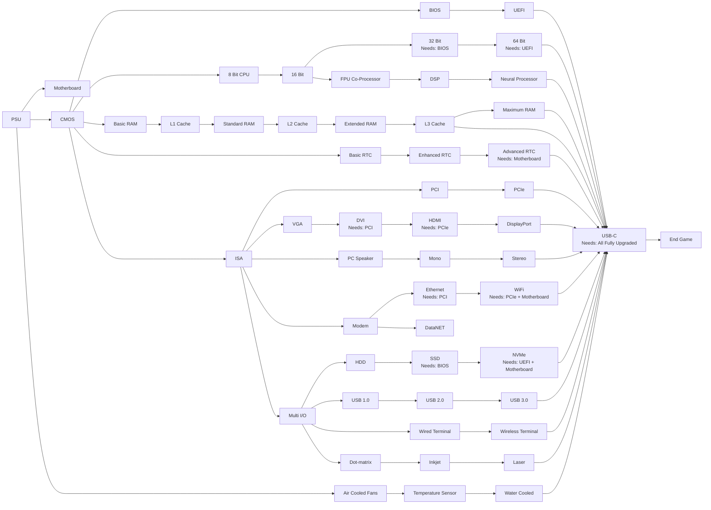

# Module Progression Chart

```mermaid
flowchart LR

  PSU --> Motherboard
  PSU --> CMOS
  PSU --> Fansa[Air Cooled Fans]

  CMOS --> BIOS
  BIOS --> UEFI
  
  CMOS --> CPUa[8 Bit CPU]
  CMOS --> RAMa[Basic RAM]
  CMOS --> RTCa[Basic RTC]
  CMOS --> ISA

  CPUa --> CPUb[16 Bit]
  CPUb --> CPUc["32 Bit<br/>Needs: BIOS"]
  CPUc --> CPUd["64 Bit<br/>Needs: UEFI"]
  
  CPUb --> CoPa[FPU Co-Processor]
  CoPa --> CoPb[DSP]
  CoPb --> CoPc[Neural Processor]
  
  RAMa --> Cachea[L1 Cache]
  Cachea --> RAMb[Standard RAM]
  RAMb --> Cacheb[L2 Cache]
  Cacheb --> RAMc[Extended RAM]
  RAMc --> Cachec[L3 Cache]
  Cachec --> RAMd[Maximum RAM]

  ISA --> PCI
  PCI --> PCIe
  
  ISA --> VGA
  VGA --> DVI["DVI<br/>Needs: PCI"]
  DVI --> HDMI["HDMI<br/>Needs: PCIe"]
  HDMI --> DP[DisplayPort]

  ISA --> Sounda[PC Speaker]
  Sounda --> Soundb[Mono]
  Soundb --> Soundc[Stereo]

  ISA --> Modem
  Modem --> Ethernet["Ethernet<br/>Needs: PCI"]
  Ethernet --> WiFi["WiFi<br/>Needs: PCIe + Motherboard"]
  Modem --> DataNET

  ISA --> MultiIO[Multi I/O]
  MultiIO --> HDD
  HDD --> SSD["SSD<br/>Needs: BIOS"]
  SSD --> NVMe["NVMe<br/>Needs: UEFI + Motherboard"]

  MultiIO --> USBa[USB 1.0]
  USBa --> USBb[USB 2.0]
  USBb --> USBc[USB 3.0]
  
  MultiIO --> Seriala[Wired Terminal]
  Seriala --> Serialb[Wireless Terminal]
  
  MultiIO --> DotMatrix[Dot-matrix]
  DotMatrix --> Inkjet
  Inkjet --> Laser

  RTCa --> RTCb[Enhanced RTC]
  RTCb --> RTCc["Advanced RTC<br/>Needs: Motherboard"]

  Fansa --> Fansb[Temperature Sensor]
  Fansb --> Fansc[Water Cooled]
  
  UEFI --> USBd["USB-C<br/>Needs: All Fully Upgraded"]
  USBc --> USBd
  CPUd --> USBd
  RAMd --> USBd
  Cachec --> USBd
  PCIe --> USBd
  DP --> USBd
  WiFi --> USBd
  NVMe --> USBd
  Serialb --> USBd
  Laser --> USBd
  CoPc --> USBd
  RTCc --> USBd
  Fansc --> USBd
  Soundc --> USBd
  USBd --> EndGame[End Game]
```
